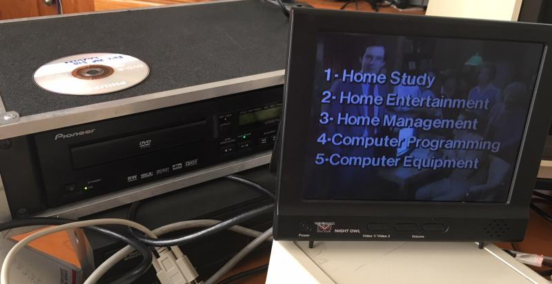

# Atari-ERIC-POP-1
Atari E.R.I.C. POP #1 Player recreates the experience of using the Atari Electronic Retail Information Center to learn about Atari 8-bit computers. Requires an Atari 8-bit computer, an Atari 850 interface (or compatable device) connected via serial cable to a Pioneer LV-4400 or compatible laserdisc player OR Pioneer DVD-V8000 DVD player.

This program simulates what the E.R.I.C. cart did: play the interactive Point of Purchase disc from an Atari computer. it doesn't work EXACTLY like the E.R.I.C. cart, but unlike the cart (which hasn't been dumped yet) my BASIC version can be easily modified. The original E.R.I.C. used a laserdisc player. My version works with an original laserdisc or a DVD that you can burn yourself. (You can burn a DVD, it's practically impossible to create a laserdisc today.) 

Here's the original forum posts describing this project: https://atariage.com/forums/topic/265316-eric-cart-electronic-retail-information-center/?do=findComment&comment=4036420
